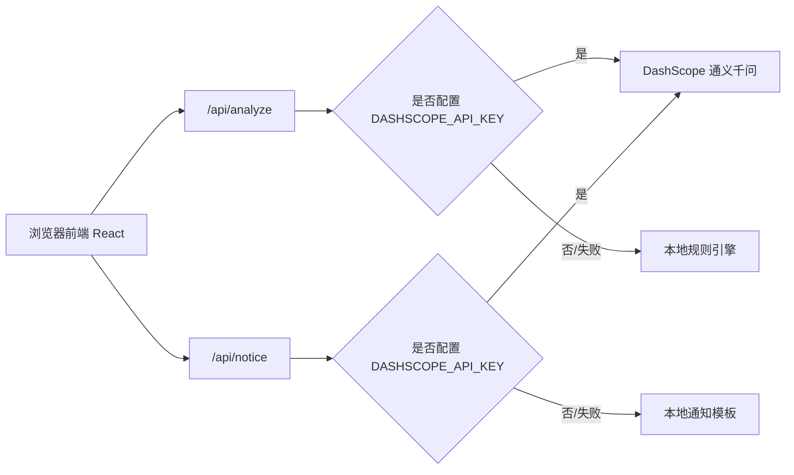

# 代码与服务端架构说明

## 1. 当前代码放在哪里

当前项目代码位于：

```text
/Users/wzy/Desktop/CodeX-20260303/比赛项目/jinzhi-assistant
```

建议后续上传到 GitHub，仓库名：

```text
jinzhi-assistant
```

## 2. 当前目录分工

```text
jinzhi-assistant/
  src/                    # 前端代码
    App.tsx               # 主工作台页面和交互逻辑
    App.css               # 产品页面样式
    index.css             # 全局样式和设计变量
    main.tsx              # React 入口

  api/                    # 当前服务端代码，部署到 Vercel Serverless Functions
    analyze.js            # 工单分析 API
    notice.js             # 通知生成 API

  data/
    sample_tickets.csv    # 30 条模拟脱敏样例

  docs/                   # 产品、技术、比赛与 OPC 文档
  public/                 # favicon、icons 等静态资源
  dist/                   # 构建产物，不作为源码维护
  node_modules/           # 依赖目录，不提交 Git
```

## 3. 当前服务端是什么

当前服务端不是单独的 Express/NestJS/Fastify 服务，而是 Vercel Serverless Functions。

也就是说：

- 本地开发时，由 Vite + Vercel 兼容方式处理前端和 API。
- 部署到 Vercel 后，`api/analyze.js` 会成为 `/api/analyze`。
- `api/notice.js` 会成为 `/api/notice`。
- API Key 放在 Vercel 环境变量里，不进入前端。

## 4. 当前请求链路



## 5. 为什么初赛先用 Serverless

| 原因 | 说明 |
| --- | --- |
| 上线快 | 不需要维护服务器、域名绑定简单 |
| 成本低 | 初赛和小流量试点足够 |
| 安全边界够用 | API Key 不暴露到前端 |
| 适合演示 | 评委和社区人员打开链接即可体验 |
| 便于 OPC 交付 | 单人可以快速完成部署和维护 |

## 6. 什么时候需要真正后端

进入复赛/决赛或真实试点后，需要从 Serverless Demo 演进到带数据库和权限的后端。

触发条件：

- 需要保存真实试点工单。
- 需要多社区/多物业隔离数据。
- 需要账号、权限、审计日志。
- 需要导出试点报告。
- 需要语音上传和转写。
- 需要长期稳定运行。

## 7. 后端演进路线

### V0.1 初赛 Demo

当前形态：

```text
React + Vite
Vercel Serverless Functions
DashScope / 规则引擎兜底
浏览器本地状态
```

适合：初赛演示、视频录制、社区轻量体验。

### V0.2 试点版

建议形态：

```text
React + Vite
Vercel Serverless Functions
Supabase Postgres
Supabase Auth 或 Clerk
对象存储保存导入文件
```

新增能力：

- 工单持久化。
- 复核记录保存。
- 试用反馈保存。
- CSV 导出。
- 简易账号。

### V0.3 复赛版

建议形态：

```text
React 前端
Node.js API 层
Postgres
对象存储
后台管理页
异步任务队列
```

新增能力：

- 批量分析队列。
- 语音文件上传和转写。
- 试点报告生成。
- 单位维度的数据隔离。

### V1.0 决赛交付版

建议形态：

```text
Web 前端
独立后端服务
数据库
权限系统
审计日志
模型网关
ASR 语音服务
报表导出服务
```

适合：社区/物业正式试点或项目交付。

## 8. 推荐数据库表

### organizations

| 字段 | 说明 |
| --- | --- |
| id | 机构 ID |
| name | 社区/物业/后勤名称 |
| type | community/property/campus/park |
| created_at | 创建时间 |

### users

| 字段 | 说明 |
| --- | --- |
| id | 用户 ID |
| organization_id | 所属机构 |
| name | 姓名 |
| role | 角色 |
| phone_hash | 手机号哈希 |

### tickets

| 字段 | 说明 |
| --- | --- |
| id | 工单 ID |
| organization_id | 所属机构 |
| raw_text_masked | 脱敏诉求 |
| source | 来源 |
| category | AI 类别 |
| urgency | AI 紧急度 |
| emotion | 情绪 |
| department | 建议部门 |
| summary | 摘要 |
| next_steps | 建议动作 JSON |
| confidence | 置信度 |
| status | 处理状态 |
| review | 人工复核 |
| created_at | 创建时间 |

### feedback

| 字段 | 说明 |
| --- | --- |
| id | 反馈 ID |
| ticket_id | 对应工单 |
| rating | 评分 |
| comment | 反馈 |
| created_at | 创建时间 |

## 9. API 演进

当前：

```text
POST /api/analyze
POST /api/notice
```

试点版新增：

```text
POST /api/tickets
GET /api/tickets
PATCH /api/tickets/:id/review
PATCH /api/tickets/:id/status
POST /api/import
GET /api/export.csv
POST /api/feedback
```

语音版新增：

```text
POST /api/transcribe
POST /api/transcribe-and-analyze
```

## 10. 代码提交和部署建议

1. 初始化 Git 仓库。
2. 提交源码和文档，不提交 `node_modules/`。
3. 上传 GitHub。
4. Vercel 连接 GitHub 仓库。
5. 配置环境变量：

```text
DASHSCOPE_API_KEY=xxx
DASHSCOPE_MODEL=qwen-plus
```

6. 绑定域名：

```text
jinzhi.22dhmv.top
```

## 11. OPC 表达口径

评委问“服务端在哪里”时，可以这样回答：

> 初赛版本采用 Vercel Serverless Functions，服务端代码在 `api/` 目录，目前包含工单分析和通知生成两个接口。这样可以快速上线并保证 API Key 不暴露。进入真实试点后，我们会接 Supabase/Postgres 保存脱敏工单、复核结果和反馈，再根据试点规模演进到独立 Node 后端。
