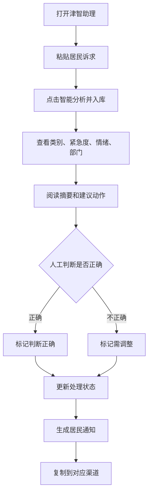
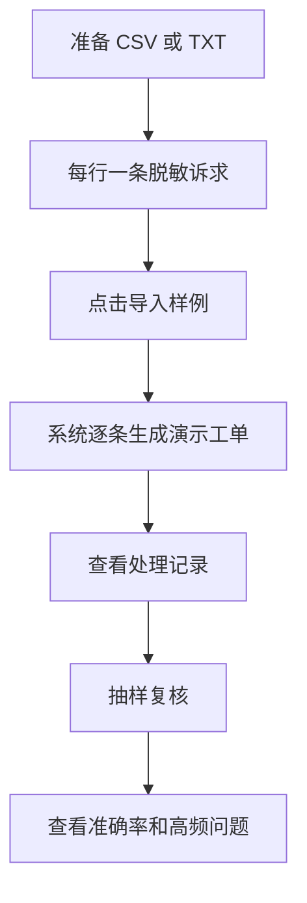
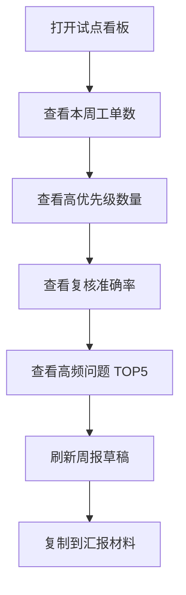
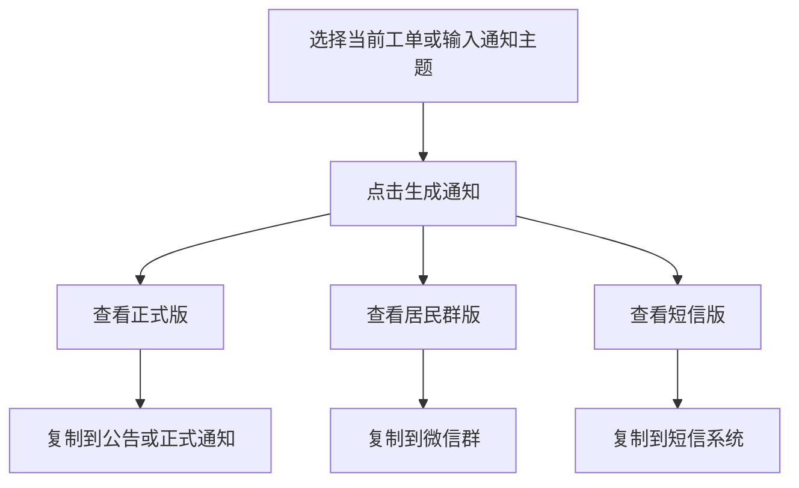

# 交互流程

## 1. 网格员处理单条诉求



## 2. 批量导入流程



## 3. 社区负责人查看流程



## 4. 通知生成流程



## 5. 异常流程

| 场景 | 系统行为 | 用户感知 |
| --- | --- | --- |
| API Key 未配置 | 使用本地规则引擎 | 仍能得到结果 |
| 模型返回非 JSON | 回退规则引擎 | 演示不中断 |
| 输入为空 | 后端返回错误，前端兜底不入库 | 后续需补前端提示 |
| 复制失败 | 显示复制失败状态 | 用户可手动选择文本 |
| 导入空文件 | 不新增记录 | 后续需补提示 |

## 6. 状态流转

### 工单处理状态

```text
待转派 -> 已转派 -> 已回访
```

### 人工复核状态

```text
待复核 -> 正确
待复核 -> 需调整
```

## 7. 社区人员使用约束

1. 输入前先去除姓名、电话、身份证、具体门牌号等敏感信息。
2. AI 输出仅作为预处理建议，不作为最终处置决定。
3. 高优先级工单必须由人工再次确认。
4. 通知文案发送前需由社区或物业负责人确认。
5. 试点数据仅用于比赛展示时，必须统一脱敏。

## 8. 下一轮交互优化

- 输入为空时给明确错误提示。
- 批量导入后展示导入成功数量。
- 支持编辑 AI 分类后再保存。
- 支持给“需调整”填写修正原因。
- 支持一键导出当前试点报告。
