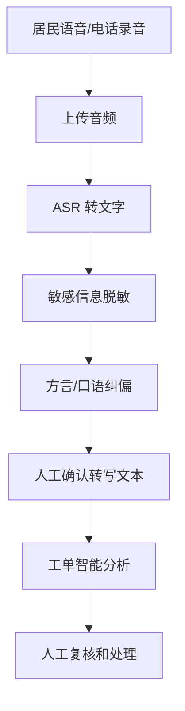

# 语音与天津方言识别方案

## 1. 为什么要处理语音和方言

比赛文档中的政务热线、社区网格、居民诉求场景都可能涉及电话、语音留言和方言表达。天津社区服务中，部分居民尤其是老人更可能用电话或语音表达诉求。

但方言识别不应在初赛阶段空喊“已支持”。合理策略是：

1. 初赛：文本工单为主，说明语音和方言是扩展路线。
2. 复赛：加入普通话语音转文字入口。
3. 决赛：用天津本地样例做方言词表和人工校正闭环。

## 2. 当前状态

当前版本尚未实现语音上传和方言识别。

当前支持：

- 文本输入。
- CSV/TXT 批量导入。
- 工单分析。
- 通知生成。

当前不支持：

- 录音上传。
- 电话录音转写。
- 天津方言识别。
- 多说话人分离。

## 3. 不马上做方言识别的原因

| 原因 | 说明 |
| --- | --- |
| 语料不足 | 没有天津本地社区语音样例，无法证明准确率 |
| 风险较高 | 方言识别错误会影响工单判断 |
| 隐私敏感 | 语音中更容易包含姓名、电话、住址 |
| 初赛不必要 | 文本工单已经能证明核心链路 |
| 需要人工校正 | 真实使用必须允许网格员修改转写结果 |

## 4. 演进路线

### V0.1 初赛

能力：

- 文本输入。
- 批量导入。
- 在文档中说明语音扩展计划。

表达：

> 当前版本优先验证文本工单预处理，暂不声称支持天津方言识别。

### V0.2 普通话 ASR

新增：

- 上传音频文件。
- 调用 ASR 服务转文字。
- 展示转写结果。
- 用户确认或修改后再进入工单分析。

可选服务：

- 阿里云智能语音交互。
- 讯飞开放平台。
- 腾讯云 ASR。
- OpenAI Whisper 类模型。

### V0.3 天津方言适配

新增：

- 天津本地高频词表。
- 社区场景专有词表。
- 方言转普通话表达纠偏。
- 人工校正记录沉淀。

示例词表：

| 方言/口语表达 | 标准表达 |
| --- | --- |
| 嘛玩意儿味儿这么大 | 公共区域存在明显异味 |
| 介楼道堵得慌 | 楼道堆物影响通行 |
| 倍儿吵 | 噪音扰民 |
| 老没人管 | 多次反映未处理 |

### V1.0 电话/语音工单

新增：

- 电话录音导入。
- 长音频切分。
- 说话人区分。
- 转写置信度。
- 低置信度片段人工确认。
- 语音原文和转写文本分开保存。

## 5. 推荐技术链路



## 6. API 设计草案

### POST /api/transcribe

请求：

```text
multipart/form-data
file: audio
```

响应：

```json
{
  "text": "转写文本",
  "confidence": 0.82,
  "segments": [
    {
      "start": 0,
      "end": 4.2,
      "text": "某楼栋楼道里堆了很多杂物"
    }
  ]
}
```

### POST /api/transcribe-and-analyze

请求：

```text
multipart/form-data
file: audio
```

响应：

```json
{
  "transcript": "转写文本",
  "analysis": {
    "category": "消防安全",
    "urgency": "高"
  }
}
```

## 7. 数据安全设计

语音数据比文本更敏感，因此必须增加：

1. 上传前告知用途。
2. 转写后立即提示用户脱敏确认。
3. 默认不保存原始音频。
4. 若保存音频，必须限定试点机构和访问权限。
5. 公开材料只展示脱敏文本，不展示原始音频。

## 8. 测试方案

### 普通话阶段

- 10 条普通话社区诉求录音。
- 对比人工转写文本。
- 计算字错误率。
- 检查工单分类是否受转写错误影响。

### 天津方言阶段

- 收集 20 条天津口语/方言诉求。
- 人工标注标准普通话表达。
- 测试 ASR 原始转写。
- 测试方言词表纠偏。
- 记录人工校正时间。

## 9. 路演表达口径

不要说：

> 我们已经支持天津方言识别。

应该说：

> 当前初赛版本聚焦文本工单预处理。考虑到社区场景中老人和电话沟通较多，我们已经设计了语音与天津方言识别路线：先接普通话 ASR，再通过天津本地高频词表和人工校正记录做方言适配。这样不会在没有语料的情况下虚假承诺，也能保证真实试点的准确性和安全性。

## 10. 近期可做的最小版本

如果复赛命题要求语音，可以先做最小版本：

1. 增加音频上传按钮。
2. 调用 ASR 服务转文字。
3. 把转写文本放入现有工单输入框。
4. 用户确认后点击分析。
5. 不保存原始音频。

这能证明语音入口闭环，但仍然保留人工确认，降低错误风险。
